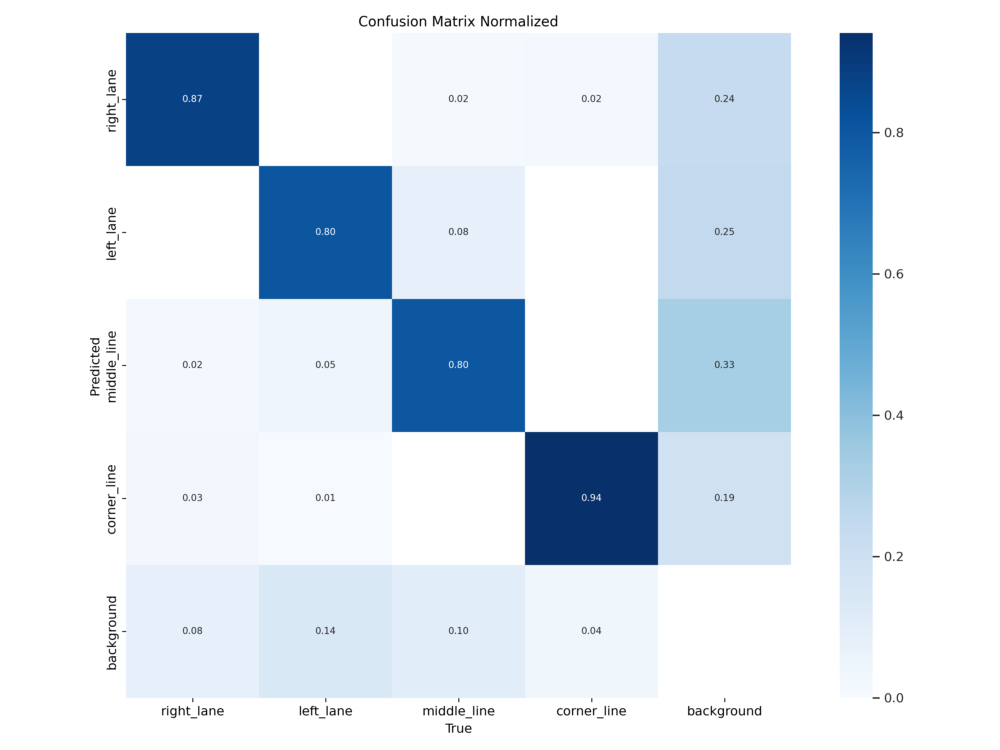
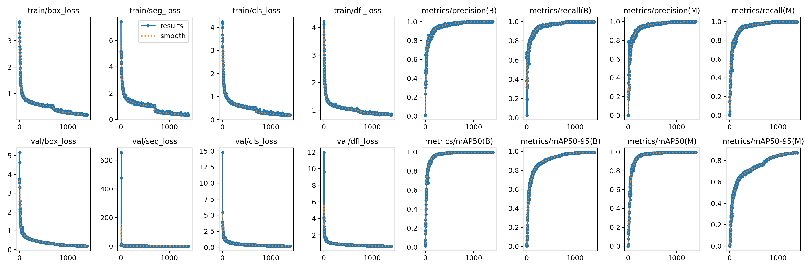
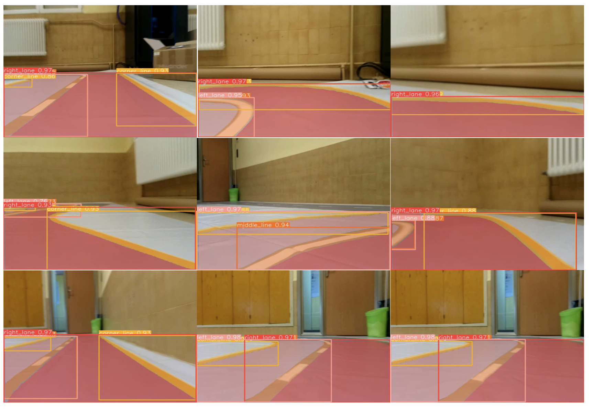

# JetRacer Autonomous Driving 

## Description
This is a Final Degree Project in [Robotics](https://www.usc.gal/en/studies/degrees/engineering-and-architecture/robotics-degree).

## Software

The employed architecture of convolutional neural network (CNN) is [YOLOv8n-seg](https://github.com/ultralytics/ultralytics). This model has been trained with a dataset of 500 images of the following circuit (Figure 1). The achieved metrics of this model are:

## Development

List TODO:
- [x] [Test JetRacer motors]()
- [x] [Keyboard Control JetRacer]()
- [x] [Gamepad Control JetRacer]()
- [ ] [Create own dataset]().
- [ ] [Train YOLO]().

## License
**JetRacer Autonomous Driving** is available under next license:

* AGPL-3.0 License: See [LICENSE](LICENSE) file for details.
## Author:
(c) 2023 ([Marcos Fernández](https://github.com/marqinhos))

