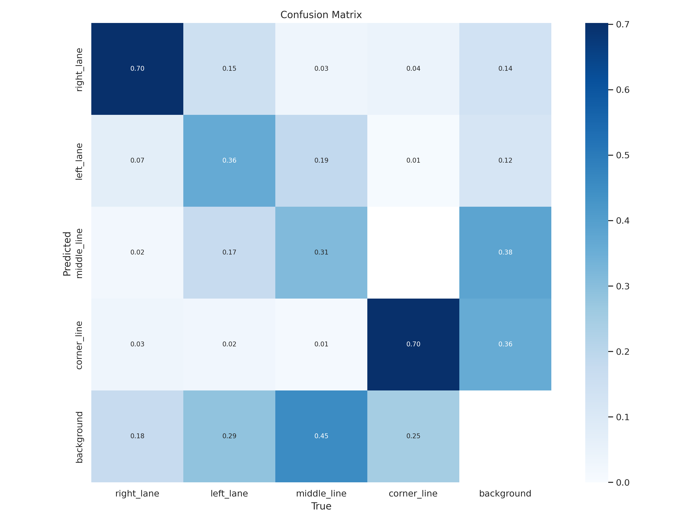
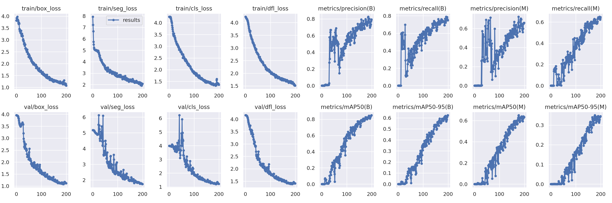
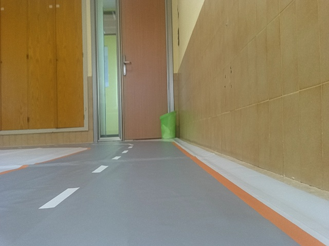
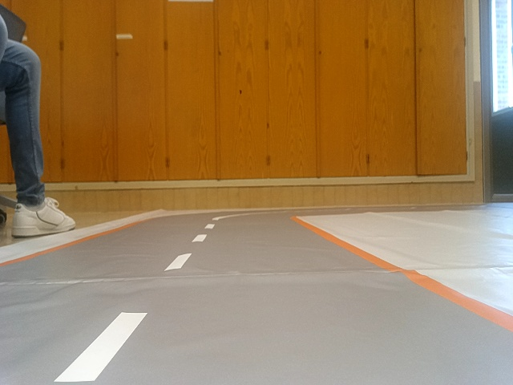
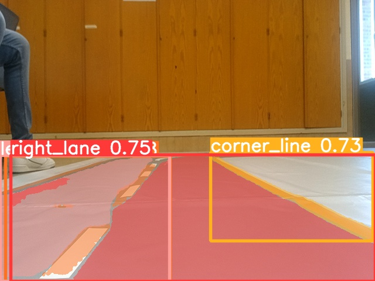
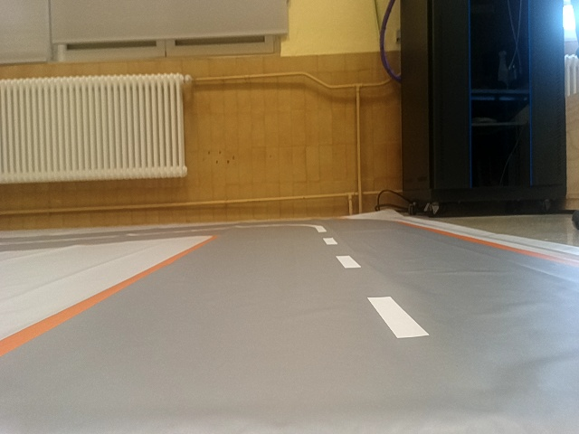
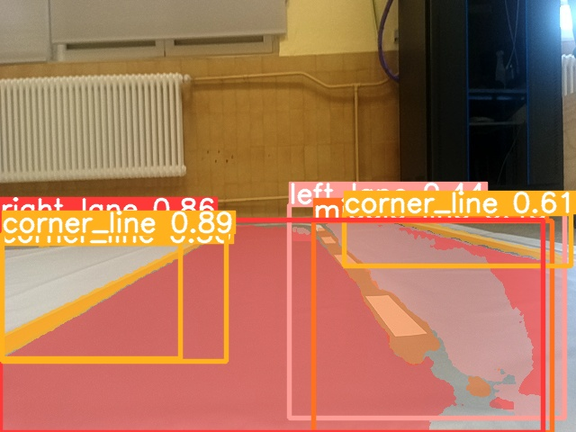

# IA Implementation


    
## Description
In this project use how backbone YOLOv8

## Software
in progress**

Train YOLOv8 for segmentation with a dataset with 98 images, and 
```python
model = YOLO('yolov8n-seg.yaml')
model.train(data='config.yaml', epochs=200, patience=60, batch=20 ,imgsz=640) 
```
Confusion Matrix             |  Results
:-------------------------:|:-------------------------:
  |  

Prediction results:
Base image                 |  Segmentate image
:-------------------------:|:-------------------------:
  |  

Base image                 |  Segmentate image
:-------------------------:|:-------------------------:
  |  

Base image                 |  Segmentate image
:-------------------------:|:-------------------------:
  |  

## Errors

* Confuse right lane with lets lane. Because for model right lane is the lane for which the car goes, and left lane is the another

## Development

List TODO:
- [x] [Test YOLOv8]()
- [x] [Train YOLOv8 only with JetRacer imgs]()
- [ ] [Create own dataset with JetRacer imgs and the speedway](). Proces
- [ ] [Freeze YOLOv8 backbone]().
- [ ] [Train YOLO]().

## Author:
(c) 2023 ([Marcos Fernández](https://github.com/marqinhos))
