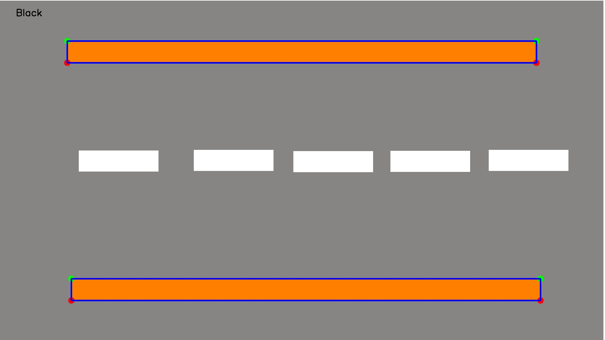

# Vision para detection

    
## Description
Color segmentation using [HSV](https://www.lifewire.com/what-is-hsv-in-design-1078068)

Example result:
First road example

Applying color Segmentation

*****

## Software
*****
## Development

List TODO:
- [ ] [Create vision color detector]()

## Author:
(c) 2023 ([Marcos Fernández](https://github.com/marqinhos))
